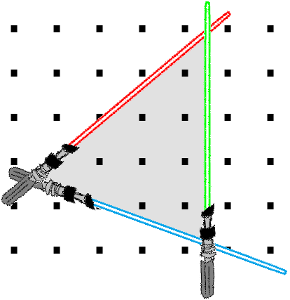

Gurowankenobi
=============


by Nihat Engin Toklu, 2015.

Gurowankenobi is a C++ interface for [GLPK](http://www.gnu.org/software/glpk/) (GNU Linear Programming Kit). The C++ interface provided by Gurowankenobi is a compatible subset of the C++ interface of the commercial [Gurobi](http://www.gurobi.com/) solver.

By using Gurowankenobi, the programs which were previously written in a Gurobi-dependent way will have the option to be compiled for working with GLPK as well.

How to use
----------

Instead of the header files of Gurobi, you just include the header file of Gurowankenobi:

```c++
#include "gurowan.hpp"
```

You do not have to link your program with GLPK. If GLPK is installed and the executable `glpsol` is on the PATH environment variable, the optimize() function of gurowankenobi library will generate the model in a temporary file, execute a GLPK process which will load the model from that temporary file, and then read the results from the standard output of the GLPK solver.

The following C++ code works:

```c++
#include <iostream>
#include <string>
#include "gurowan.hpp"

int main()
{
    GRBEnv env;
    GRBModel model(env);

    // set the model sense (minimization or maximization)
    model.set(GRB_IntAttr_ModelSense, GRB_MINIMIZE);

    // add variables to the model
    //GRBVar varname = model.addVar(lowerBound, upperBound,
    //    coefficientInObjFunc, varType, varnameAsString);
    GRBVar x1 = model.addVar(0, 100, 1, GRB_CONTINUOUS, "x1");
    GRBVar x2 = model.addVar(0, 100, 1, GRB_CONTINUOUS, "x2");
    GRBVar x3 = model.addVar(0, 2, 0, GRB_INTEGER, "x3");

    // actually updating is not necessary in gurowankenobi
    // the following line is for compatibility
    model.update();

    // add the constraint Constr1: 6*x2-3*x1 <= 20-x3
    model.addConstr(6 * x2 - 3 * x1 <= 20 - x3, "Constr1");

    std::cout << "num. of vars: "
              << model.get(GRB_IntAttr_NumVars) << std::endl;

    std::cout << "num. of constrs: "
              << model.get(GRB_IntAttr_NumConstrs) << std::endl;

    std::cout << std::endl;

    // solve the model
    model.optimize();

    // show the results
    std::cout << "REPORTING RESULTS:" << std::endl;

    std::cout << "x1:" << x1.get(GRB_DoubleAttr_X) << std::endl;
    std::cout << "x2:" << x2.get(GRB_DoubleAttr_X) << std::endl;
    std::cout << "x3:" << x3.get(GRB_DoubleAttr_X) << std::endl;
    std::cout << "objective:" << model.get(GRB_DoubleAttr_ObjVal) << std::endl;

    int status;
    status = model.get(GRB_IntAttr_Status);
    std::cout << "status:" << status << std::endl;

    if (status == GRB_OPTIMAL)
    {
        std::cout << "It's optimal!" << std::endl;
    }

    return 0;
}
```

License
-------
Gurowankenobi is free/open-source software. Licensing details are as follows:

    Copyright (c) 2015 Nihat Engin Toklu < http://github.com/engintoklu >

    Boost Software License - Version 1.0 - August 17, 2003

    Permission is hereby granted, free of charge, to any person or organization
    obtaining a copy of the software and accompanying documentation covered by
    this license (the "Software") to use, reproduce, display, distribute,
    execute, and transmit the Software, and to prepare derivative works of the
    Software, and to permit third-parties to whom the Software is furnished to
    do so, all subject to the following:

    The copyright notices in the Software and this entire statement, including
    the above license grant, this restriction and the following disclaimer,
    must be included in all copies of the Software, in whole or in part, and
    all derivative works of the Software, unless such copies or derivative
    works are solely in the form of machine-executable object code generated by
    a source language processor.

    THE SOFTWARE IS PROVIDED "AS IS", WITHOUT WARRANTY OF ANY KIND, EXPRESS OR
    IMPLIED, INCLUDING BUT NOT LIMITED TO THE WARRANTIES OF MERCHANTABILITY,
    FITNESS FOR A PARTICULAR PURPOSE, TITLE AND NON-INFRINGEMENT. IN NO EVENT
    SHALL THE COPYRIGHT HOLDERS OR ANYONE DISTRIBUTING THE SOFTWARE BE LIABLE
    FOR ANY DAMAGES OR OTHER LIABILITY, WHETHER IN CONTRACT, TORT OR OTHERWISE,
    ARISING FROM, OUT OF OR IN CONNECTION WITH THE SOFTWARE OR THE USE OR OTHER
    DEALINGS IN THE SOFTWARE.
